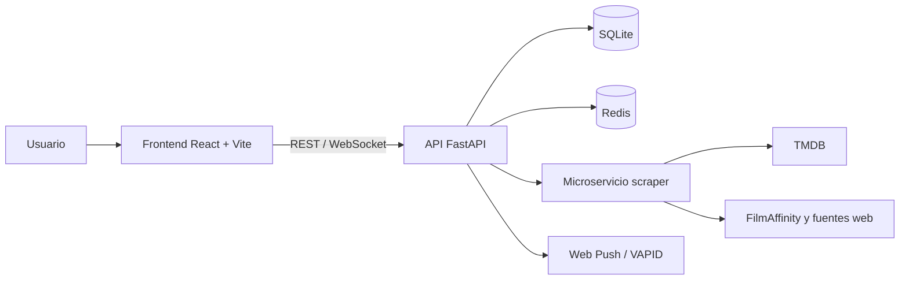

# CineVerse

Plataforma web para descubrir películas y series, decidir qué ver en pareja o
con amigos y organizar la experiencia de principio a fin.

CineVerse combina un catálogo enriquecido, votaciones sincronizadas en tiempo
real, recomendaciones personalizadas, sesiones de cine cercanas, calendario,
notificaciones y estadísticas compartidas en una PWA instalable.

## Características

- Catálogo de películas y series con información de TMDB.
- Descubrimiento por tarjetas y decisiones tipo *swipe*.
- Salas privadas para parejas y grupos de amigos.
- Votación y detección de coincidencias en tiempo real mediante WebSockets.
- Historial compartido, puntuaciones y lista de pendientes.
- Recomendaciones por afinidad basadas en contenido.
- Cartelera, próximos estrenos y búsqueda de sesiones en cines cercanos.
- Análisis de sentimiento de reseñas y agregación de noticias.
- CineVerse Wrapped y métricas de visualización en pareja.
- Exportación de eventos en formato ICS e integración con Google Calendar.
- Autenticación local y acceso con Google.
- Notificaciones Web Push mediante VAPID.
- Panel de telemetría para tiempos de respuesta, errores y actividad de la API.
- Aplicación web progresiva con soporte de instalación.

## Arquitectura



| Servicio | Tecnología | Puerto |
| --- | --- | --- |
| Frontend | React 18, Vite, Tailwind CSS, PWA | `3000` con Docker |
| API principal | FastAPI, SQLAlchemy, WebSockets | `8000` |
| Scraper | FastAPI, BeautifulSoup, TextBlob | `8001` interno |
| Caché | Redis | `6379` interno |
| Persistencia | SQLite | Archivo local del backend |

## Tecnologías

**Frontend:** React, Vite, Tailwind CSS, Canvas Confetti, Color Thief,
QR Code React y Workbox.

**Backend:** Python 3.11, FastAPI, SQLAlchemy, PyJWT, WebSockets, Redis,
scikit-learn y pywebpush.

**Obtención de datos:** TMDB API, BeautifulSoup, lxml, TextBlob y RapidFuzz.

**Infraestructura:** Docker y Docker Compose.

## Requisitos

La forma recomendada de ejecutar el proyecto requiere:

- Docker Engine 24 o superior.
- Docker Compose v2.
- Una cuenta y credenciales de la API de TMDB.

Para desarrollo sin contenedores también se necesita Python 3.11, Node.js 20 y
una instancia local de Redis.

## Configuración

1. Clona el repositorio:

   ```bash
   git clone https://github.com/amm927/cineverse.git
   cd cineverse
   ```

2. Crea un archivo `.env` en la raíz:

   ```dotenv
   TMDB_API_KEY=tu_api_key
   TMDB_READ_ACCESS_TOKEN=tu_read_access_token
   JWT_SECRET=una_clave_larga_y_aleatoria

   OAuth_CLIENT_ID=tu_cliente_google

   VAPID_PUBLIC_KEY=tu_clave_publica
   VAPID_PRIVATE_KEY=tu_clave_privada
   VAPID_SUBJECT=mailto:tu-email@example.com
   ```

   `TMDB_API_KEY` o `TMDB_READ_ACCESS_TOKEN` son necesarios para cargar el
   catálogo. Google OAuth y VAPID son opcionales si no se usan el acceso con
   Google ni las notificaciones push.

3. Para desarrollo local, establece la variable del servicio `frontend` en
   `docker-compose.yml`:

   ```yaml
   VITE_BACKEND_URL: http://localhost:8000
   ```

   La configuración versionada puede apuntar a una URL pública de despliegue.

## Ejecución con Docker

Construye e inicia todos los servicios:

```bash
docker compose up --build
```

Una vez completado el arranque:

- Aplicación: [http://localhost:3000](http://localhost:3000)
- API: [http://localhost:8000](http://localhost:8000)
- Swagger UI: [http://localhost:8000/docs](http://localhost:8000/docs)
- OpenAPI: [http://localhost:8000/openapi.json](http://localhost:8000/openapi.json)

Para detener el entorno:

```bash
docker compose down
```

La base de datos SQLite y los avatares se almacenan dentro de `backend/`, que
está montado como volumen durante el desarrollo.

## Desarrollo local

### Backend principal

```bash
cd backend
python -m venv .venv
.\.venv\Scripts\activate
pip install -r requirements.txt
uvicorn app.main:app --reload --port 8000
```

Configura `SCRAPER_SERVICE_URL=http://localhost:8001` y
`REDIS_URL=redis://localhost:6379/0` cuando los servicios se ejecuten fuera de
Docker.

### Microservicio scraper

```bash
cd backend-scraper
python -m venv .venv
.\.venv\Scripts\activate
pip install -r requirements.txt
python -m textblob.download_corpora
uvicorn main:app --reload --port 8001
```

### Frontend

```bash
cd frontend
npm install
npm run dev
```

Vite sirve la aplicación en [http://localhost:5173](http://localhost:5173).
Puede configurarse mediante:

```dotenv
VITE_BACKEND_URL=http://localhost:8000
VITE_GOOGLE_CLIENT_ID=tu_cliente_google
```

## Pruebas y validación

Ejecuta las pruebas del scraper:

```bash
python -m unittest backend-scraper/test_showtimes.py
```

Comprueba que el frontend genera una compilación de producción:

```bash
cd frontend
npm run build
```

También puedes validar el estado de los contenedores:

```bash
docker compose ps
```

## Estructura del proyecto

```text
.
|-- backend/
|   |-- app/
|   |   |-- auth.py
|   |   |-- calendar_helper.py
|   |   |-- database.py
|   |   |-- main.py
|   |   `-- scraper.py
|   |-- Dockerfile
|   `-- requirements.txt
|-- backend-scraper/
|   |-- main.py
|   |-- test_showtimes.py
|   |-- Dockerfile
|   `-- requirements.txt
|-- frontend/
|   |-- public/
|   |-- src/
|   |   |-- components/
|   |   `-- hooks/
|   |-- Dockerfile
|   |-- package.json
|   `-- vite.config.js
|-- docker-compose.yml
`-- README.md
```

## API

La especificación interactiva completa está disponible en `/docs`. Los grupos
principales de endpoints son:

| Área | Ruta base |
| --- | --- |
| Catálogo y detalle | `/api/movies`, `/api/series` |
| Autenticación y perfil | `/api/auth`, `/api/users` |
| Parejas y salas | `/api/partner`, `/api/rooms` |
| Decisiones y coincidencias | `/api/movies/decide`, `/api/series/decide`, `/api/matches` |
| Historial y estadísticas | `/api/history`, `/api/wrapped`, `/api/couples/stats` |
| Recomendaciones | `/api/recommendations` |
| Cartelera cercana | `/api/cinemas/nearby` |
| Calendario | `/api/calendar` |
| Notificaciones | `/api/notifications` |
| Telemetría | `/api/admin/telemetry` |
| Tiempo real | `/ws/room/{sala_codigo}/{usuario_id}` |

## Seguridad

- No publiques el archivo `.env`, claves VAPID, tokens de TMDB ni secretos JWT.
- Sustituye siempre el valor JWT predeterminado en entornos compartidos o de
  producción.
- Restringe los orígenes CORS antes de desplegar públicamente.
- Sirve el frontend y la API mediante HTTPS para OAuth, PWA y Web Push.
- Utiliza almacenamiento persistente y copias de seguridad para la base de
  datos en producción.

## Estado del proyecto

Proyecto académico individual desarrollado para la asignatura Desarrollo Rápido
de Aplicaciones de la Universidad de Almería.
